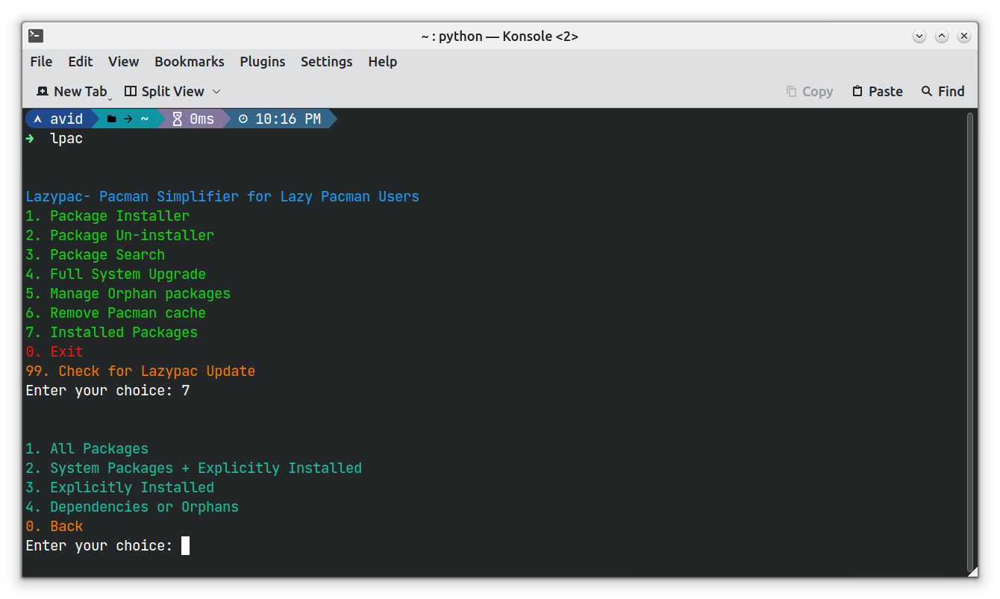

### Lazypac: Pacman Simplifier

 

 

 

**Make sure python is installed in your machine.**

**For directly running from terminal, you can use bash aliasing by the following command:**

`curl -O --output-dir "$HOME" https://raw.githubusercontent.com/redwan-hossain/lazypac/main/lazypac.py && echo 'alias lpac="python $HOME/lazypac.py"' >>~/.bashrc && source ~/.bashrc`

**Now just type `lpac` in the terminal to use LazyPac**
